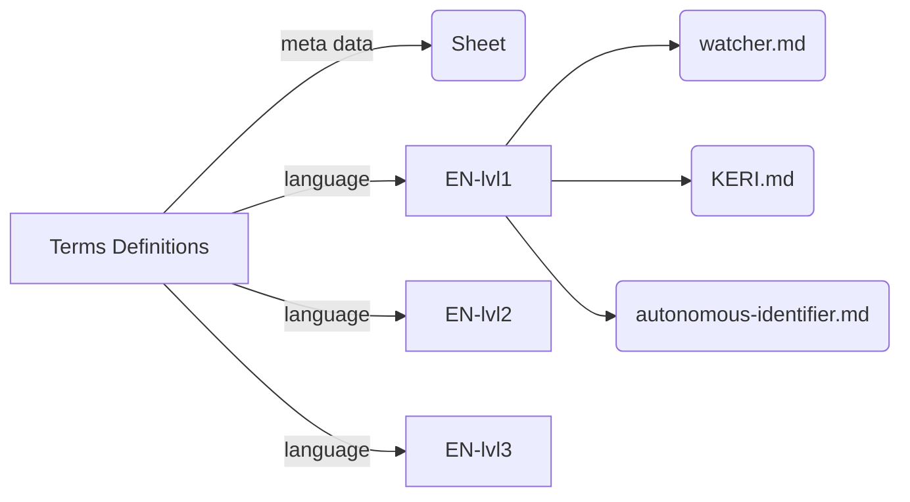

## Audiences and languages

We have audiences that need to be addressed in their own language along three axes:
1. Level of Understanding: we currently use three levels of understanding
2. Languages: e.g., Switzerland has four languages
3. Jargon: language specific to the field of expertise

### Design principle
We stick to one language in the most specific (or most elaborate definition of a term) for the source: American English

Jargon needs a separate term definition to specify the term that covers a known concept for an inner circle but is unknown to the outside world.

We use AI tools to translate to more general language for a lower level of understanding in the line of work or the mental model.

We use AI tools to translate to a different language from the source language. E.g. English -> German & French & Italian. Why?: because it's a lot of work to maintain term definitions in four languages by hand and have every single term definition still cover the same concept. 

We always generate a link to the original, most elaborate source in the base language. Why?: to back your AI-generated translations with the human-curated source.

### The projected directory structure

