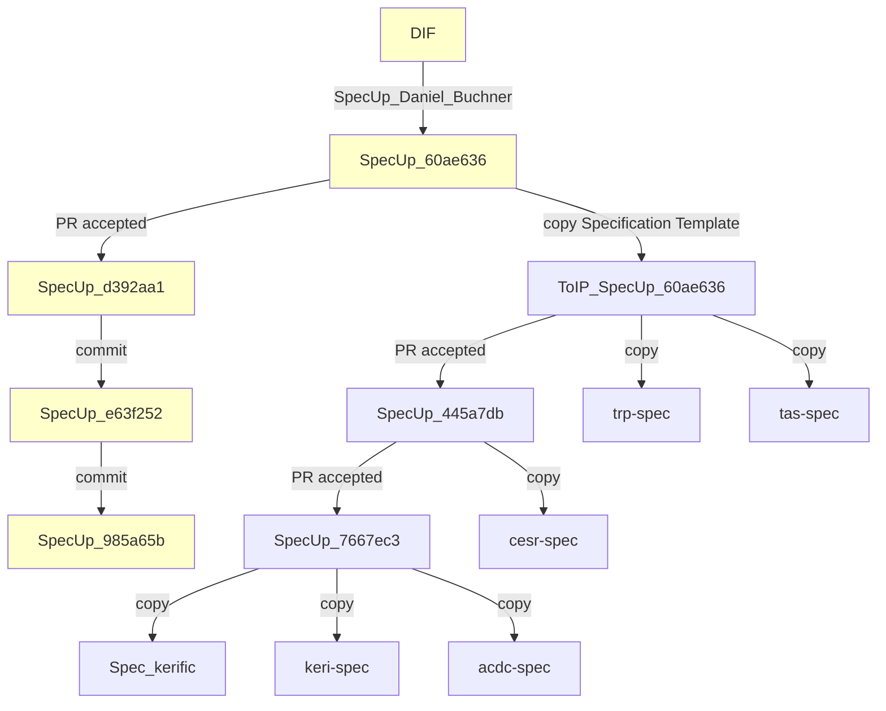
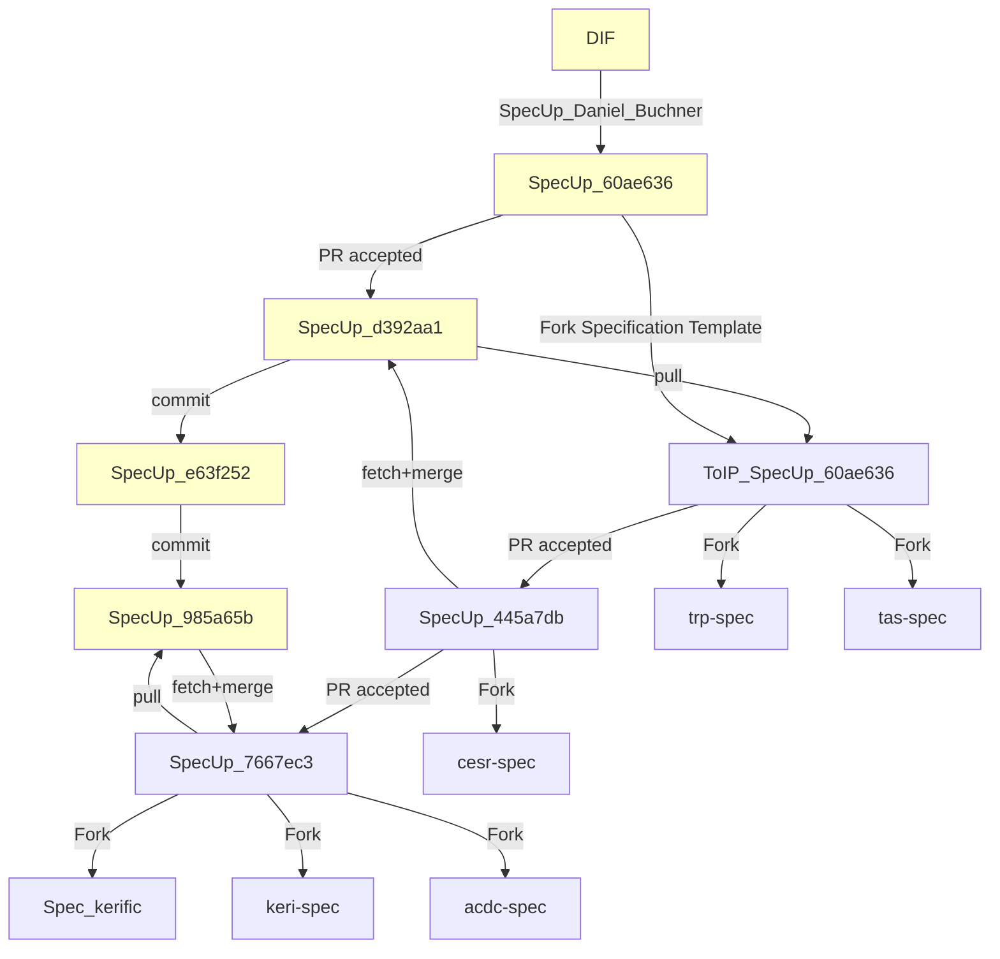
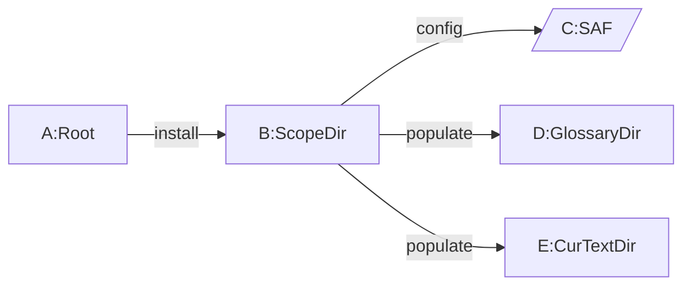
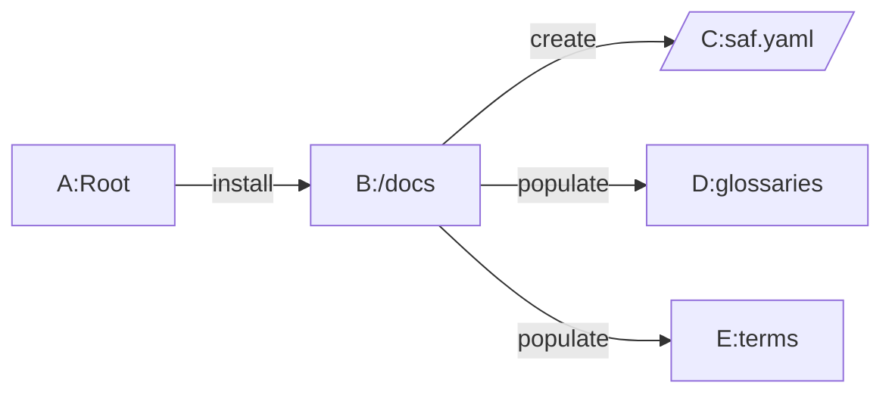

## Integration
This is an informative section

Spec-Up, Spec-Up Glossary tool, TEv2, and the KERISSE-engine (search engine, KERIDoc education) plus kerific tooling are gradually going to be integrated for the sake of concept & terminology management in ToIP.

This section might be why we anticipate this Governance Guide on future development the way we've done in the previous sections.

### Concerns
We share some concerns raised over the first months of 2024.

#### Spec-Up and Specification Template

The current copy-and-paste strategy is leading to merging horror and "unrelated histories."

How should we work to stay in tune with each other and easily accept improvements?

**Noticed the differences?**
1. Through *forking* instead of *copying* we keep git histories compatible
2. Through `fetch+merge` (or `pull` when no conflicts are expected), we not only keep DIF and ToIP synced, but also it is very straightforward to update all the gh-pages-based specification websites that *use* the Specification Template to:
   - sync functionality and data
   - offer PRs from any of those installs

#### Roadmap to TEv2
As a TEv2 creator and frontman, we share Rieks Joosten's viewpoint on this proposal for using Spec-Up refs and defs. 

He explained that the same features being discussed here were also added to TEv2. 

There is always tension between adding a lot of features and taking a long time or keeping things very minimal. He pointed out that creating glossaries based on cherry-picking glossary entries based on personal preferences can be problematic because it doesn't actually establish shared understanding and criteria for defining terms.  
The larger the group involved and the more varied their cultural backgrounds, the more problematic that can become. However, that doesn't mean we shouldn't start with tools that are actually working right now. Rieks' personal preference is to use terminology that expresses the author's intentions clearly. For example, reading the Spec-Up documentation was challenging for Rieks, because it was difficult to understand it without more context.

Rieks would like to have several more sessions on TEv2 so we can still look at how we can use it for our terminology. He's not opposed to enhancing Spec-Up for these features but, at the same time, keeping TEv2 tooling in progress. 

Rieks Joosten concluded that we need to see what tools are actually needed by both authors and readers to help them comprehend the terms they use. He can also explore how TEv2 tooling can be used to produce Spec-Up definitions.

Rieks Joosten was in favor of proceeding with changes to Spec-Up but also continuing the work on TEv2 to tackle larger issues of terminology management.

#### TEv2 Explanation

##### Current structure

#### Docusaurus example CURRENT

#### SpecUp example CURRENT

##### Internal Scope

##### External Scopes and internal scope

##### Full architecture

#### Always archive, never delete

Darrell O'Donnell clarified that technical maintainers will not delete any ToIP repos but will only archive them.