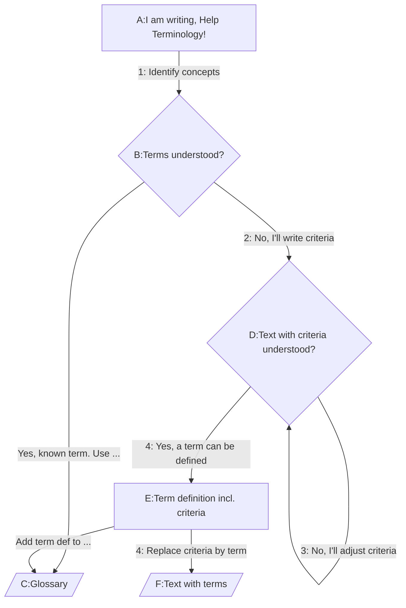
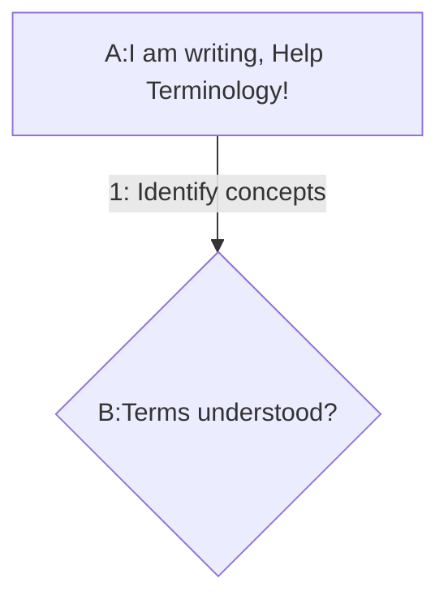
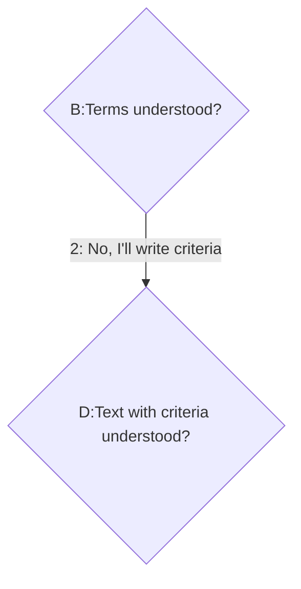
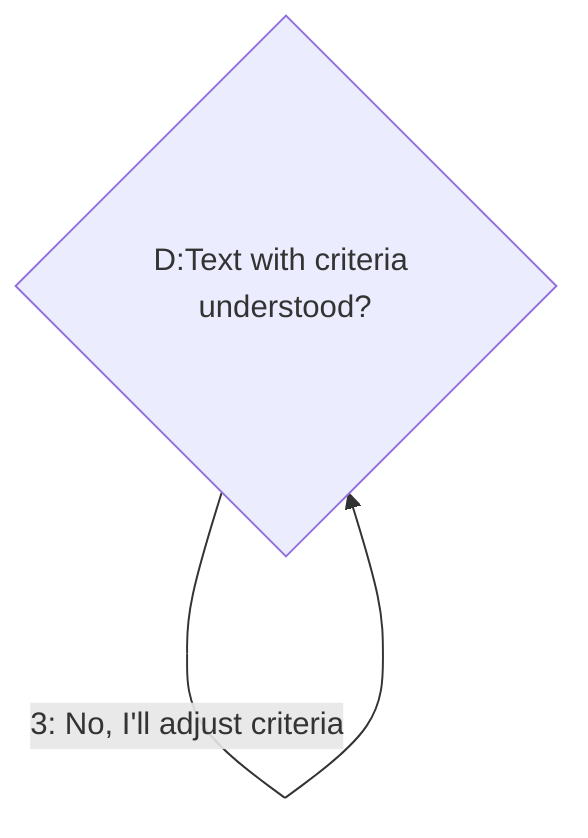
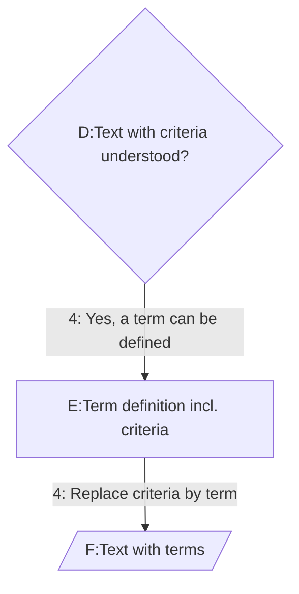

## Terminology design aids
::: note Basic Note
  Check this out.
:::

 “Why do we need to design terminology? Can’t we simply write our ideas down, look up some definitions and add them, or search for some explanatory texts if clear definitions lack in the heat of the writing process?"

 "We don’t have a problem, do we? Why all the fuzz and juggling all these terms and definitions about terms and definitions? It’s not getting better, is it?

 "Please let me just write my document and add some glossary items and we’re done. We skip all the academic hassle about *meaning, concepts, artefacts* and what have we. Let’s get work done!”

You recognize a few of those remarks? If communication and understanding each other were just that easy, we could leave the hard part out. But **we can't skip the design of terminology** if we want to convey a (new) concept.

::: warning Warning Notice
Hold your breath for the magic word, **the solution for everything** in terminology design! 
:::

But first we have to make a small, but very important detour! And that is: 

> why are we doing this?!

### Who benefits

For who are we doing this, what can this person do with it and what is the unique result?

Are you going to be faster, better, easier-going in writing texts? Will you be better understood by a larger audience?

The brief answer is *yes*. Just imprint this paragraph for more backing:

::: note Why are we doing this?
**Authors and curators** of texts can follow this guideline for terminology design in order to **create their terminology**, **invent smart criteria to distinguish their concepts from others**, thereby identifying their own concepts clearer, understand their peers better and finally **be understood better** and quicker by others.
:::

Oops the magic word is in there! Have you been able to locate it? No? Keep going!

### Reality check

Most term definitions in the world do not comply with the distinguishing-criteria rule, and that’s the uniqueness of this Guide: it’s easy to follow and the result is an immensely improved terminology.

This guide won't be as comprehensive as the [TNO Terminology Design](https://tno-terminology-design.github.io/design-methods/). However, we offer the best of both worlds, resulting in: simplicity and speed and about eighty percent the right way how it should be done.

Before we’ll share the *all-encompassing solution* in just one word, we’ll lay out the step-by-step to get your terminology done.

### Iterate through concepts

The idea is that anyone willing to explain some concepts by (first) understanding the perception of the receiving party will go through this loop for every term that is unclear, conflates, or is otherwise not fully understood.

::: note At least one criterium?
At least one clear generally applicable criterium should come out of this step-by-step per term.
:::

Tada! Our matching guidelines are:
1. Start writing your objectives and ideas, and identify the concepts behind the terms you use ([why](#why-objectives)-[what is it](#what-identifying)?) 
2. Write the concept in a specific way: formulate criteria ([why](#why-criteria)-[how](#how-criteria)-[what is good](#what-good-criteria)?) when you expect confusion to arise
3. As long as a term is not understood by the target group: replace it with your criteria ([why](#why-replace)-[how](#how-replace)?) 
4. As soon as it’s understood: define the term with those criteria and replace the criteria in the text with the term. ([why]((#why-back-terms)-[how](#how-back-terms)?) 

### Example: Health Care intake

Although we inevitably introduce some unexplained terms with an example, here’s an example:

#### Step 1

In the digital identity field you might want to write a vision document on how Self-Sovereign Identity could work in Health Care. One of the concepts / mechanisms within healthcare is to be absolutely sure who(se knee) is going to be operated next. You write how that’s going to work out with terms covering this reassurance: *validation* and *verification*. The concept as a whole concluded succesfully we call *authentication*.

#### Step 2

“Validation” and “Verification” of a visitor at the desk of the outpatient clinic are terms that might conflate with the “authentication” that needs to be succesfully fullfilled: “Is this person really who he/she says he/she is?!”

You decide to distinguish validation and verification with a criterium for verification: 

> it must be “an automatic digital process” to be verification.

The criterium is simple: must be an automatic digital process. 

This distinguishing criterium comes in handy because validation can also be something a person does!

Decryption on a computer is verification, checking a passport by the desk officer is not.

#### Step 3

Although you wrote ‘authentication is partly done by *an automatic digital process* called verification’, your team members are confused by the word ‘digital’. One of them brings forward that ‘computerized’ instead of digital is clearer and the team agrees unanimously.

For the sake of the team members that weren’t present at the meeting, you leave the criteria in the text:

‘authentication is partly done by *an automatic computerized process* called verification’

#### Step 4

Everyone understands the criteria and the term covering the concept behind it. You could now put the term definition including the criteria in your Terminology Engine and Glossary and replace the criteria in the text with only the term used:

‘authentication is partly done by verification'

The term definition looks like this:

[[def: verification]]
 ~ 
 a data item or statement may be cryptographically securely attributable to its source (party at the source end) by any recipient verifier (party at the destination end) The process must be an automatic computerized process.
 
**End of example.**

In this process and iteration you could look for over-arching or adjacent term definitions (with criteria!) that match your concept. Of this is the case, you could adopt a term definition, with or without an extra note. 
That’s when consensus building comes in as a spin-off of your terminology design.

### The magic word

Still wondering what the magic word could be? No worries! Ladies and gentlemen … (drum roll) … the magic word in designing all your terms, defining them in a reproducible way so that anyone could identify your concepts, understand your ideas better and apply the word by himself or herself…… (drums hold!)…:
Criteria!

A least one well-formulated criterium is what we need per term definition, or should we say we need *minimally one* in order to distinguish wether something is 
- included or excluded from the definition
- inside or outside of the concept behind the term
Criteria! It just pure magic.

::: warning Wait, wait. Come back. Please?
Ah, happily you’re still here. We need to share a question at this stage. Remember, we’re trying to offer a simple and speedy guideline to create great terminology for your project. 
:::

Why is it so **d.mn** difficult to get people to write proper criteria? If the “magic word” ‘criteria’ delivers to the promise, why all the fuzz, why are nearly all definitions in the digital world without proper criteria??

Because…
- it’s work, it’s a task
- it needs practise
- it needs communication
- it needs understanding others
- it needs the dear wish to want to understand other people first, before you push to be understood.

### The why and how of all steps

Our guidelines revisted, but now with reasons and further instructions.

### 1. Start writing your objectives and ideas, and identify the concepts behind the terms you use 

#### why writing your objectives and ideas down [#why-objectives]
You want to be understood and seek support for your plans or ideas. To guide this process, it's good to have a reference.

#### what is "identifying a concept"? [#what-identifying]
An identifier points to something, in this case to a concept. Identification is the process of clearly describing what the concept is and defining the term that points to it.

### 2. Write the concept in a specific way: formulate criteria when you expect confusion to arise

#### why criteria? [#why-criteria]
Another person should be able to apply wording to a certain concept and then be able to independently decide whether something falls in or out of the criterium. Example: if a stool is defined with the criterium "all furniture to comfortably sit on with exactly 3 legs from seat to each non-fixed contact point of the leg on the floor", then anyone could (dis)qualify various instances of something to sit on that looks like a stool to many.
Although you might not fully agree that a 4-legged stool is no stool according to this definition with this criterium, the fact is that it's the generally applicable criterium that we were looking for.

::: note Important consideration
Communication, understanding and learning will sky rocket with clear criteria, invest time in them and earn time back further down the road.
:::

Example: moving stools

If a group of people had to move every stool, but only stools, from a furniture warehouse into a large lorry without clear criteria what a stool is and isn't, you will end up leaving stools behind and for sure bringing back half a lorry of furniture upon unloading.

#### how to formulate criteria [#how-criteria]

In text. And you could add examples to a criterium of edge cases / corner cases: what falls just in the criterium and what is just outside?

#### what are good criteria? [#what-good-criteria]

Criteria that are determistic and clearly distinguish something.

### 3. As long as a term is not understood by the target group: replace it with your criteria

#### why replace terms by criteria? [#why-replace]

Criteria can be independently applied, terms have a aledged meaning and interpretation might of terms might point to distinctive concepts.
Example: *move the stools into the van* might be interpreted as "break out the fixed stools in the cantina and bring the remnants to the van".

#### how to replace terms by criteria? [#how-replace]

Simply replace the term by the sentences criteria might consist of.

Example: *move the stools into the van* -> *move into the van all furniture to comfortably sit on with exactly 3 legs from seat to each non-fixed contact point of the leg on the floor*

### 4. As soon as it’s understood: define the term with those criteria and replace the criteria in the text with the term.

#### why put back terms [#why-back-terms]

Once you've succesfully identified a concept for all stakeholders, it makes no sense to maintain repetitions of lengthy criteria descriptions in a text. Maitenance of the criteria is also easier with a single point of defnition. 

#### how to put back terms [#how-back-terms]

Be sure to create a Terminology definition with the criteria and identify this concept with the term intended.

For example:

[[def: stool, stools]]
 ~ furniture to comfortably sit on with exactly 3 legs from seat to each non-fixed contact point of the leg on the floor

AND then change the concept criteria in the text with the concept term:

move the [[ref: stools]] into the van.

### Wrap up

Isn’t the magic word "Criteria" a bit cruel? It might snatch the average human being in the heart of their weakness: understanding others. Yet "mutual understanding" is needed to be able to formulate criteria.

### Move forward

Note that Terminology building is concise and extensive work. Beyond the basic terms, often defined as noun or noun phrase (e.g. "validation" and "peer to peer validation" ) we come accross these challenges:
  - **different styles** to describe a concept: nouns, verbs, adverbs, adjectives, and relationship. E.g. validation, validator, validate, validated, valid?, validly?, validated data, validated person, validated intake, etc.
  - **abbreviations** for example VALD, p2p-validation
  - **synomyms** {case dependent}
  - **forms** e.g. validations, Validation, Peer-to-peer Validation, etc.

See more here: https://tno-terminology-design.github.io/design-methods/
