## Integration
This is an informative section

Spec-Up, Spec-Up Glossary tool, TEv2 and the KERISSE-engine plus kerific tooling are gradually going to integrated for the sake of concept & terminology management in ToIP.

This section might why we anticipate with this Governance Guide on future development the way we've done in the previous sections.

### Concerns
We share some concern raised over the first months in 2024.

#### Spec-Up and Specification Template

Current copy and paste strategy leading to merge horror "unrelated histories".

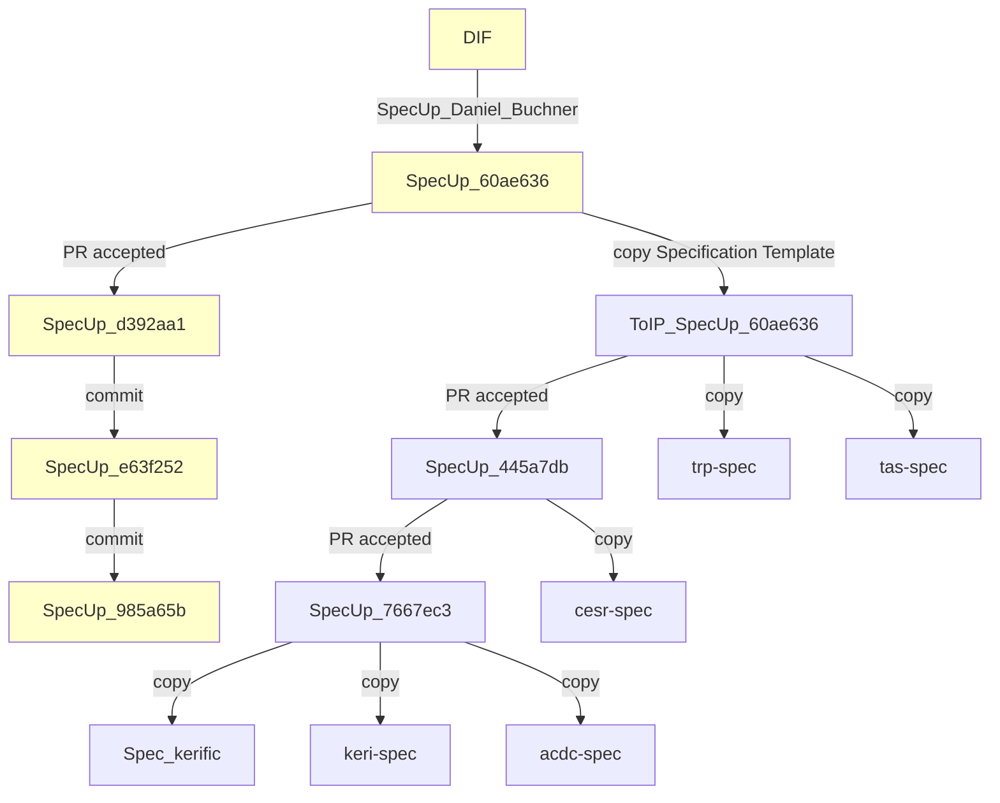

How we should fork to stay in tune with each-other and easily accept improvements?

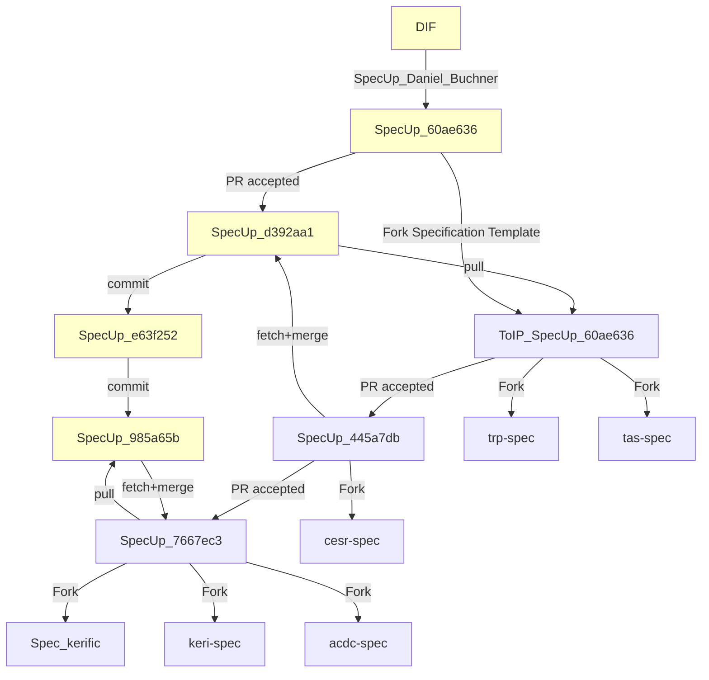
**Noticed the differences?**
1. Through *forking* instead of *copying* we keep git histories compatible
2. Through `fetch+merge` (or `pull` when no conflicts expected) we not only keep DIF and ToIP synced, but also it is very straightforward to update all the gh-pages-based specification websites that *use* the Specification Template to:
   - sync functionality and data
   - offer PRs from any of those installs

#### Roadmap to TEv2
As a TEv2 creator and frontman we share Rieks Joosten's viewpoint on this proposal for using Spec-Up refs and defs. 

He explained that the same features being discussed here were also added to TEv2. 

There is always tension between adding a lot of features and taking a long time, or keeping things very minimal. He pointed out that creating glossaries based on cherry-picking glossary entries based on personal preferences can be problematic because it doesn't actually establish shared understanding and criteria for defining terms.  
The larger the group involved, and the more varied their cultural backgrounds, the more problematic that can become. However, that doesn't mean we shouldn't start with tools that are actually working right now. Riek's personal preference is to use terminology that expresses the author's intentions clearly. For example, in reading the Spec-Up documentation, it was challenging for Rieks to understand it without more context.

Rieks would like to have several more sessions on TEv2 so we can still look at how we can use it for our terminology. He's not opposed to enhancing Spec-Up for these features, but at the same time keeping TEv2 tooling in progress. 

Rieks Joosten concluded that we need to see what tools are actually needed by both authors and readers to help them comprehend the terms they use. He can also explore how TEv2 tooling can be used to produce Spec-Up definitions.

Rieks Joosten was in favor of proceeding with changes to Spec-Up, but also to continue the work on TEv2 to tackle larger issues of terminology management.

#### TEv2 Explanation

##### Current structure
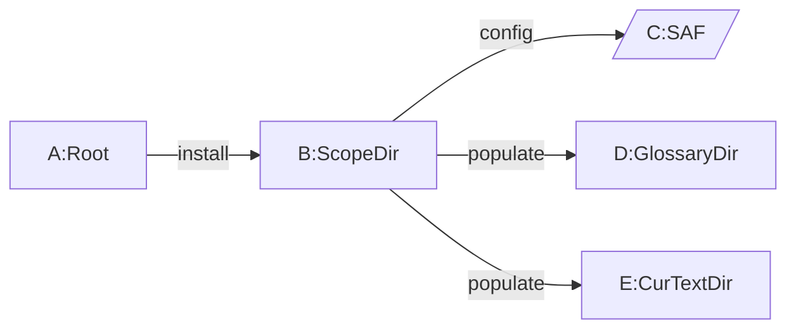

#### Docusaurus example CURRENT
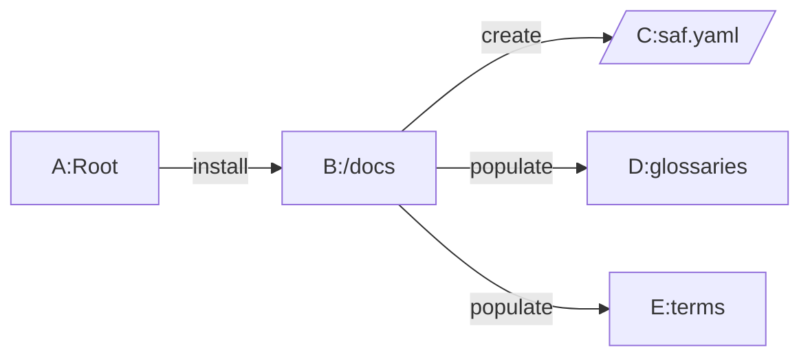
#### SpecUp example CURRENT

##### Internal Scope Terminology - 0.1: no links & no classDef & no new forms
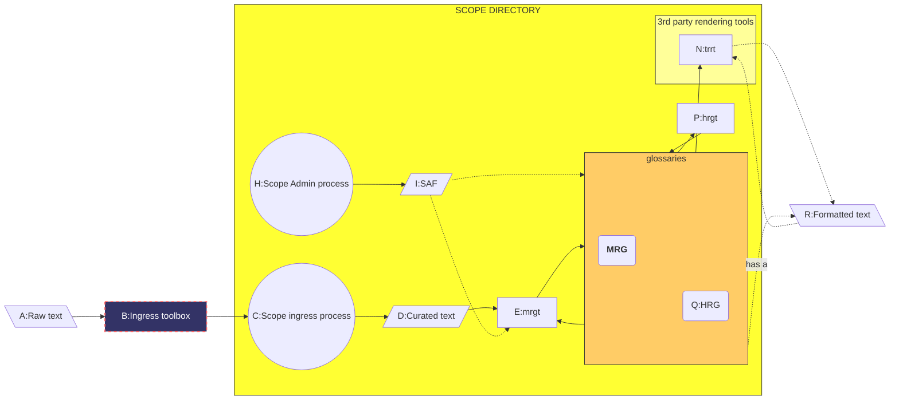

##### Internal Scope Terminology - 0.2: no links & no classDef & no styles
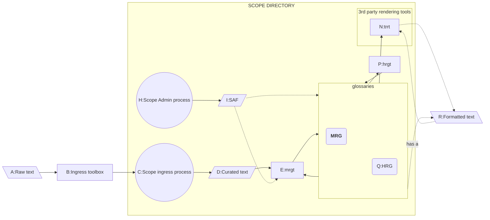

##### Internal Scope Terminology - 0.3: isolate - no subgraphs
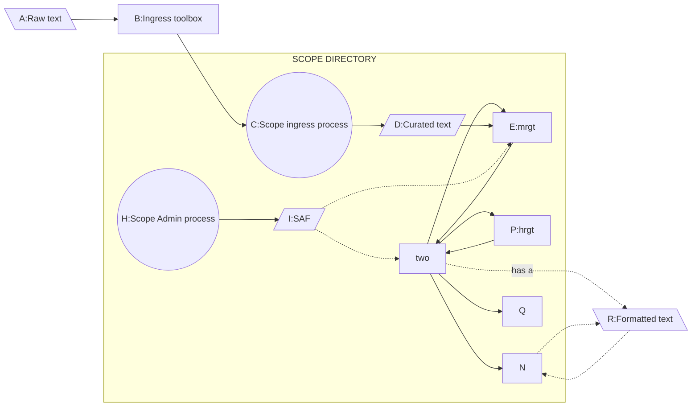

##### Internal Scope Terminology - 0.3.1: isolate - no comment

##### Internal Scope Terminology - 0.3.2: isolate - no strange symbol
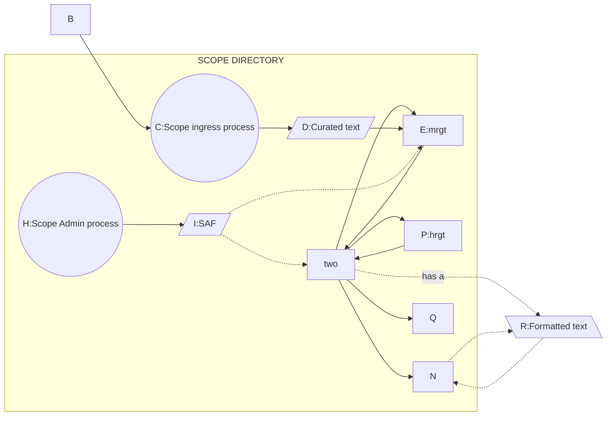

##### Internal Scope Terminology - 0.3.3: isolate - no subgraphs!
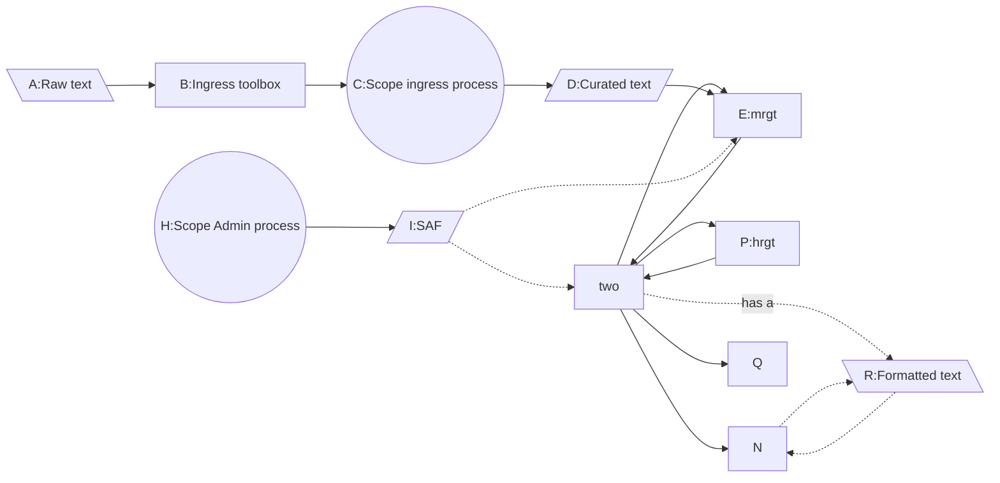

##### Internal Scope Terminology - 0.4: isolate - all other strange stuff gone
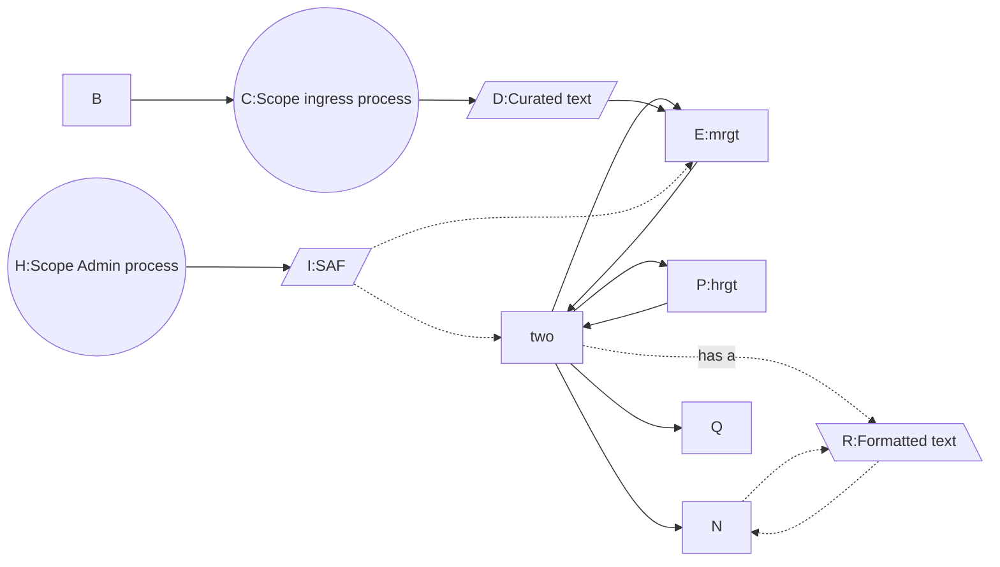

##### Internal Scope Terminology - 1: no links & no classDef

##### Internal Scope Terminology - 2: no classDef
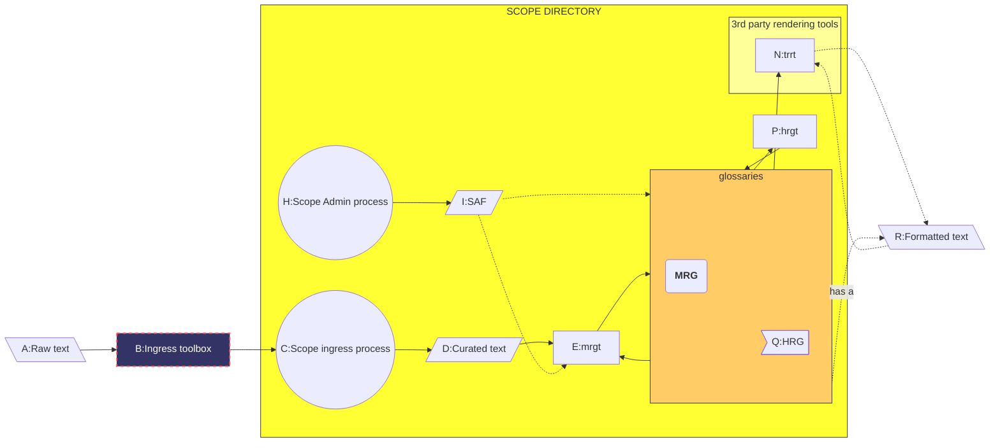

##### Internal Scope Terminology - 3 : no links

##### Internal Scope Terminology
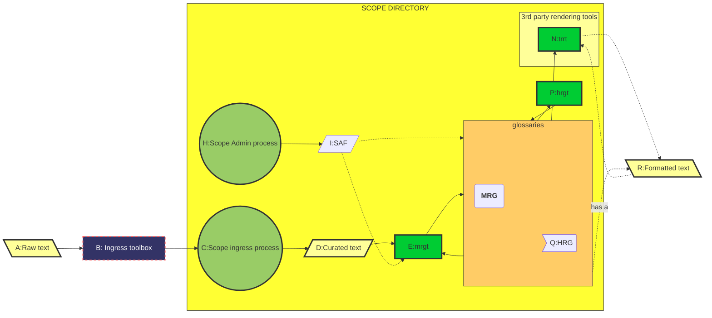

##### External glossary import
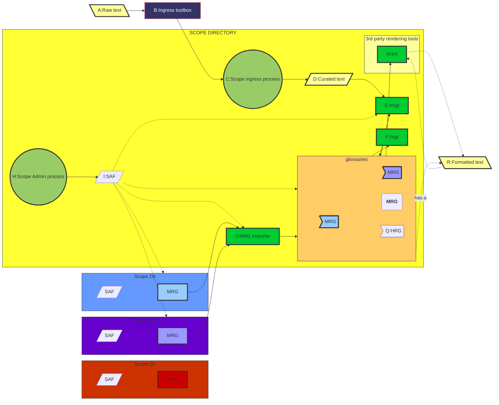

##### Full architecture
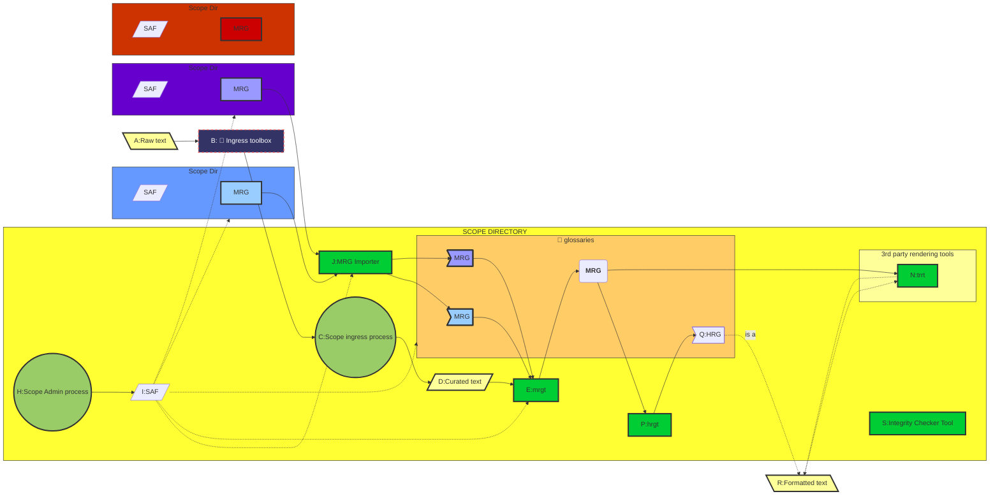

#### Always archive never delete

Darrell O'Donnell clarified that technical maintainers we will not delete any ToIP repos, but will only archive them.

| TBW |