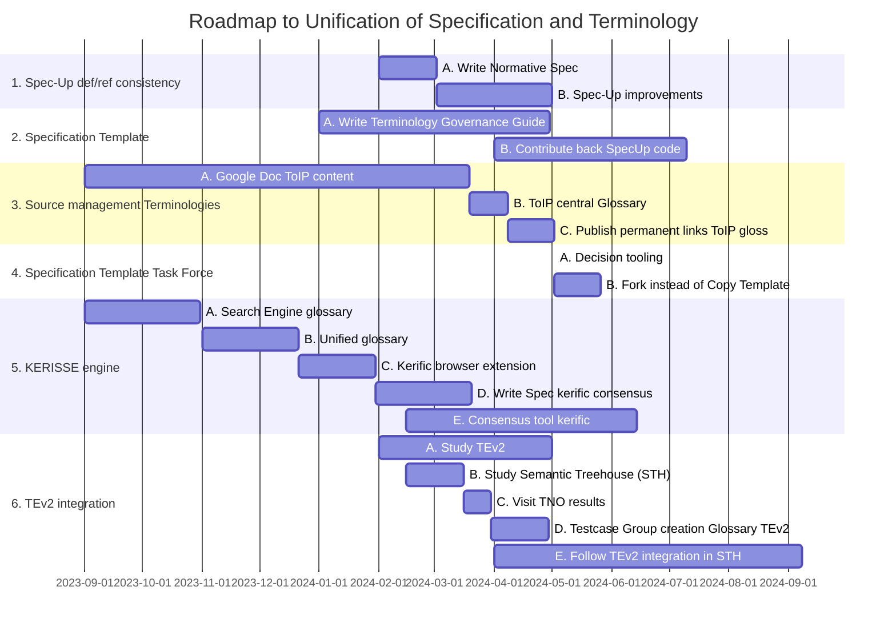

[//]: # (Pandoc Formatting Macros)

[//]: # (\mainmatter)

[//]: # (\doctitle)

## Scope

This Guide goes with the flow as much as it can. This means:
- git and github for version control, issue-handling and project management in the own github repo
- The existing Slack group CTWG for discussions
- Use of github wiki-based source management of terminologies
- Proposal to archive obsolete sources of terminology
- Reuse harvesting / consensus creation tools that are available and anticipate improvements of those
- Connect to TEv2 step by step
- Use Spec-Up / specification template and anticipate improvements of this

### Roadmap

Let's clear up the issues around TEv2 versus Spec-Up and KERISSE tooling. The goal is unification and we prevent reinventing tools that are already in place.

The issue of unification is open, and it might be solved. By whom is not yet clear. A sequence numbered roadmap to unification (presumming that that's the goal) can be found below.

##### Temporary solution: pictures

