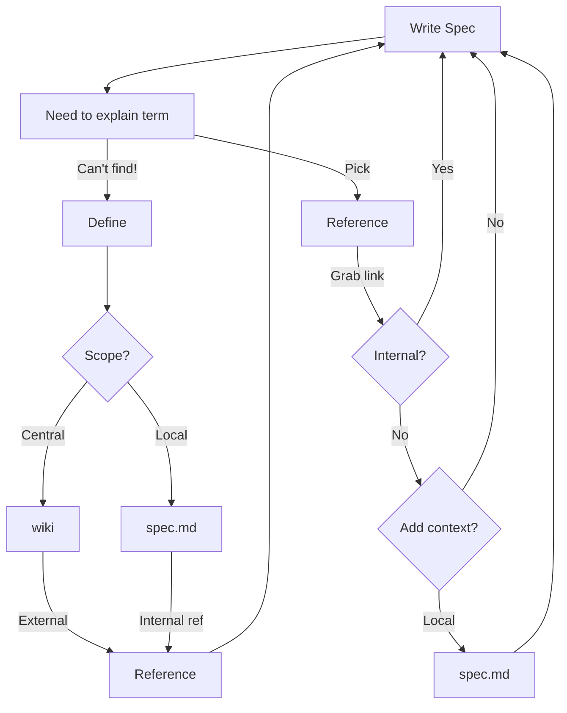

## Tools landscape

People like to understand the components and structure of ToIP's concepts and terminology machinery and its governance.

### git and github

##### Why?
- We need to know who did what
- We need to be able to get back and link to historical (intermediate) result

##### How?
Every role that changes stuff (Create, Update or Delete) needs to be on github and sign off their work

This way:
- original sources are GitHub managed and so is the provenance of each definition
- we can track provenance carefully. This is a step towards fully managed, individually versioned glossary management tooling such as being developed with TEv2 and KERISSE.

### Github landscape

Every group within ToIP that uses Spec-Up has a setup more or less like the following. Only WOT-terms uses a combination of wiki source management and publication in KERISSE (Still Docusaurus-based, looking into a Spec-Up variant as of Feb 2024).

Platform| Git branch | Software
----: | --------------: | ---------:
github.com repo| main or 'own choice' |Spec-Up|
^^  || VsCode |
^^ || Node.js / NPM |
github.io pages |gh-pages| `user.github.io/repo` |
^^ |  | github actions |
^^ |  | kerific |
github.com wiki| master |`github.com/user/repo/wiki`|
^^ || github actions |
[Infrastructure Terminology Engine ToIP]

### Flow of Writing a Specification in Spec-Up

### Combining central, external and internal references to definitions

| TBW : ToIP's position on KERISSE (a superset of terms and concepts documentation) and TEv2? |

ToIP might need both, particularly to onramp organizations leveraging ToIP.

What are the components of the following glossary/term/concept toolsets

- Github (repo, pages and wiki)
- Spec-Up
- KERISSE platform toolset
- TEv2 toolset

What features exist in both, and what is unique in each toolset? If there is overlap, how are they different (e.g., how does an author craft a link from a word in a source document to a term in a specified glossary), and how could they be combined?

What is the future of the KERISSE suite and TEv2?

| TBW |